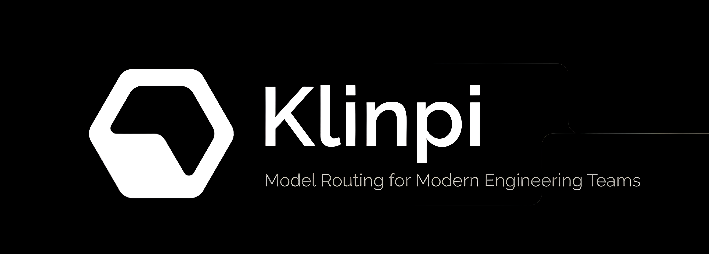

<p align="center">
  
</p>

<p align="center">
  
  
  
</p>

# KlinPi

**KlinPi** is an cloud coding agent — think of it as a self-hostable, hackable take on Devin. It runs in a sandboxed
cloud environment, takes a task description, and autonomously plans, writes, tests, and iterates on code in a real dev
environment (its own shell, file system, and browser) until the task is done.

This project is in active early development. Expect breaking changes.

## Why KlinPi

Most "AI coding agent" demos are thin wrappers around a single API call. KlinPi is built as actual infrastructure:

- **Full sandboxed workspace** — each agent run gets its own isolated environment with a shell, filesystem, and package
  manager, not just a chat window.
- **Model-agnostic routing** — swap the underlying LLM per task without rewriting the agent loop.
- **Observable by default** — every tool call, file diff, and shell command the agent makes is logged and replayable.
- **Self-hostable** — run it on your own infra with Docker, no vendor lock-in.

## Tech Stack

| Layer               | Technology                                               |
|---------------------|----------------------------------------------------------|
| Language            | TypeScript                                               |
| Runtime             | Node.js 20+                                              |
| Testing             | [Vitest](https://vitest.dev/)                            |
| Agent orchestration | Custom TS agent loop (tool-calling, planning, execution) |
| Sandbox execution   | Docker containers per agent session                      |
| API layer           | Node HTTP server (REST)                                  |
| Package manager     | pnpm                                                     |

## Getting Started

### Prerequisites

- [Docker](https://www.docker.com/) and Docker Compose
- Node.js 20+ (only needed for local dev outside Docker)
- pnpm (`npm install -g pnpm`)

### Run with Docker (recommended)

This is the fastest way to get KlinPi running end-to-end, including the sandbox runner.

```bash
git clone https://github.com/<your-username>/klinpi.git
cd klinpi
cp .env.example .env   # add your model provider API key(s)

docker compose up --build
```

The agent API will be available at `http://localhost:3000`.

To stop:

```bash
docker compose down
```

### Run locally (without Docker)

```bash
git clone https://github.com/<your-username>/klinpi.git
cd klinpi
pnpm install
cp .env.example .env

pnpm dev
```

### Run tests

```bash
pnpm test
```

Test setup and config live in `vitest.config.ts`.

## Project Structure

```
klinpi/
├── packages/
│   ├── gateway/        # Express backend (auth, API routes, middleware)
│   ├── studio/         # Next.js frontend (landing page, auth UI)
│   ├── runtime/        # Agent runtime environment
│   ├── compute/        # Compute layer
│   └── realtime/       # WebSocket server
├── platform/
│   └── prisma/         # Database schema, migrations, generated client
├── tests/
│   ├── gateway/        # Gateway integration tests
│   └── studio/         # Studio tests
├── dockerfile/         # Container build
├── infra/              # Infrastructure config (Prometheus)
├── scripts/            # Setup scripts
├── docker-compose.yml
└── vitest.config.ts
```

## Roadmap

- [ ] Persistent agent memory across sessions
- [ ] Browser tool for the agent's sandbox
- [ ] Web UI for monitoring live agent runs
- [ ] Multi-agent task delegation
